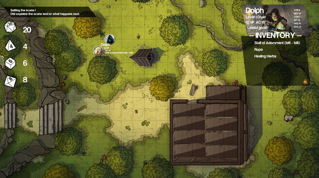

# Mirkwood Engine 🧝

A prototype of a virtual tabletop written in Go and Ebiten.

#### Status/TODOs

Very much a prototype - PR welcomed ! :)

- [ ] Use a proper go library in sound.go
- [ ] Use a json config file for players character sheet
- [ ] Implement proper logic for combat - Requires proper knowledge of the tabletop game
- [ ] Remove licensed assets if any
- [ ] Investigate Ebiten v2
- [ ] ...

#### Usage

    ./build.sh
    ./mirkwood_engine

Press 'U' to get shortcuts info

#### Platforms

Only tested on Linux for now.

#### Assets/Artwork used

Fantastic Maps from DiceGrimorium <3 : https://imgur.com/user/DiceGrimorium

Dice icons from the Noun Project

Magic the Gathering Art for "player headers"

Harabara Mais Demo font

Others arts I wish I could credit but don't have any reference.