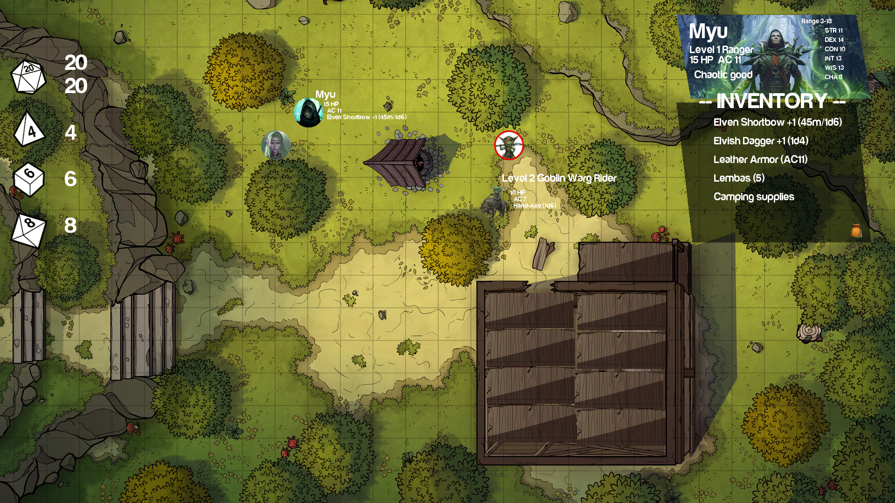

# Mirkwood Engine 🧝

A prototype of a virtual tabletop written in Go and Ebiten.

#### Status

Very much a prototype - PR welcomed ! :)

#### Usage

    ./build.sh
    ./mirkwood_engine

Press 'U' to get shortcuts info

#### Platforms

Only tested on Linux for now.

#### Assets/Artwork used

Fantastic Maps from DiceGrimorium <3 : https://imgur.com/user/DiceGrimorium

Dice icons from the Noun Project

Magic the Gathering Art for "player headers"

Harabara Mais Demo font

Others arts I wish I could credit but don't have any reference.